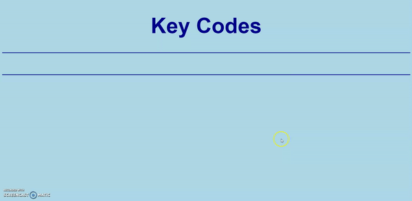

# keyCodes

**[PLAY HERE](https://arditti93.github.io/keyCodes/)**

Very Simple aplicaton that displays key codes for any key pressed on the keyboard

### Approach 
```
//ALT
$('body').keyup(function(e){
  var code = e.which
  if(code == 18){
    e.preventDefault()
    $('#display').html('Alt Key<br>'+code)
  }
}); 
```

The keyup event is sent to an element when the user releases a key on the keyboard. It can be attached to any element, 
but the event is only sent to the element that has the focus in this case the body of the HTML document.
If the key code equals 18 (ALT key) then the key and code are displayed in the HTML elements of with the id of display 




